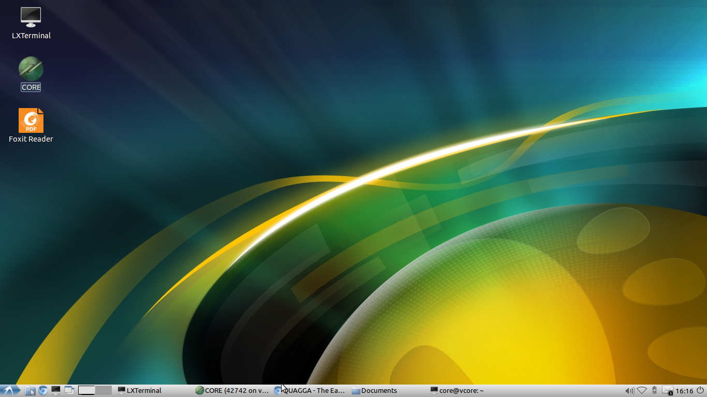
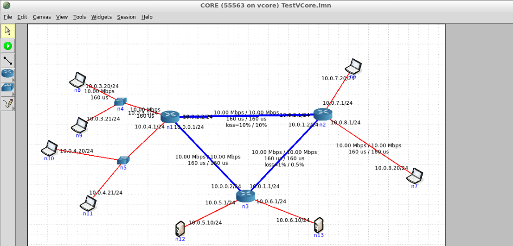

# Virtual Networks Lab using Linux and the CORE Network Emulator

# Lab 1: Introduction 

This lab assumes you have already installed the VCore virtual machine and started the CORE package as provided in the [ReadMe](https://github.com/kelsayed/CoreNetLab/ReadMe.md) file. 

**Important Note**: Both the user name and password to the Vcore Linux installation are "core"

1. Start the  Vcore virtual machine

2. The Linux virtual machine will start and you will see on the desktop a green icon named CORE as shown below
   

    

3. Double click on CORE icon, the CORE emulator starts

4. Select File -\> Open and browse to /home/core/.core/configs/TestVCore.imn
   You should see a network topology as shown below.
    
   This [TestVCore.imn]((https://github.com/kelsayed/CoreNetLab/NetTopo/TestCore.imn)) file is also available on this [github repository](https://github.com/kelsayed/CoreNetLab/NetTopo/TestCore.imn) for those who will start the installation from scratch. 

5. Click on the Green start button on the left panel in VCore window

6. In this topology, the nodes n1, n2, and n3 are full-fledged routers based on Quagga software. This software is an open source implementation of routing protocols supporting RIP, OSPF, BGP-4. It has a configuration interface almost identical to Cisco IoS-based routers.

7. Nodes n4 and n5 are Ethernet switches, whereas the rest of the nodes n6 through n13 are Linux hosts. They support all Linux commands available on the Vcore Linux installation.

8. Wait till all nodes have a green square around them. Right Click on node 7, select shell window and then bash. Repeat for node 8. You now have full control over these two nodes via the bash shell script (Linux equivalent to DOS prompt).

9. On node n7 ping and traceroute the path to n8 by issuing the commands:
    1.  `ping 10.0.3.20`
    2.  `traceroute 10.0.3.20`

10. Change link parameters on the path between n8 and n7 like delay, loss, capacity, and watch how ping performance behaves. Note that links are not symmetric and you may need to configure both directions.

11. Run iperf3 performance tool to generate traffic and measure throughput/delays. More about iperf3 will be provided later. For now, do the following:
    1. On n8 run an iperf3 server, issue the command:\ 
	`iperf3 --s --D`\
	This means the following:  
​    `--s` run as server\
​    `--D` run as daemon (run the process disconnected in the background)\
    2. On n7 run an iperf3 tcp client, issue the command\
	`iperf3 --c 10.0.3.20 --t 1000 --i 10 --w 4k`\
	This means the following:\ 
	`--c` client run as client with 10.0.3.20 being address of node n8 at which iperf3 server executes\
	`--t` 1000 run for duration of 1000 seconds\
	`--i` 10 report results every 10 seconds\ 
	`--w 4k` use TCP window size of 4 kbytes\

12. More information on iperf3 can be found [here](https://fasterdata.es.net/performance-testing/network-troubleshooting-tools/iperf-and-iperf3/)

13. Now you are ready to explore more. Go to  [Brian Linkletter web site](http://www.brianlinkletter.com/core-network-emulator-test-drive/). 
    Try all the steps there with traffic generation etc.

14. Move the mouse to any node in the vcore window and Right Click on the node and select Wireshark and then select any of the network interfaces.

15. Wireshark (a network packet analyser) will start and may report some error message, ignore it.

16. Start a wireshark capture, select **psedu-device that captures all interfaces** as shown below.
     

17. From wireshark menu select capture, you will get a dialog as in the above picture. Go to the capture filter and write tcp (or udp). Start a traffic session using iperf3 and make sure you observe packets in the wireshark window (see picture below). Click on a packet and have a look at the headers of the different layers, TCP, IP, Ethernet.
     

18. Open File Manager on Linux and get familiar with browsing and opening files etc. You can find a folder called /home/core/Documents where some important documents to be used in the other labs can be found.

19. Optionally, get familiar with basic Linux commands like ls, cp, mv, gedit. Type man ls, man cp, man mv, man gedit to know more information.

20. Learn how to switch back and forth between Linux and Windows. Pressing the right control key (Host key) + F puts Linux into full screen mode, and Host+C puts it in a scaled mode where it appears as another program in Windows (or your Host OS in general).

21. Try also capturing USB device in Linux by selecting Devices-\>USB from the virtualbox host window and select your USB drive to be able to move files between Linux and Windows. Do the reverse (unselect) to be able to see the USB drive back in Windows.

22. When you are done and want to leave the virtual machine, move the mouse to the bottom of the Linux screen (if working in full screen mode) some menu will pop up among which there is a menu item called File.
     Select it and select Close -\> Save the machine state. This will enable you to come back where you left off.
     Alternatively, select Machine -\> ACPI Shutdown and choose Hibernate so that you come back to the Linux virtual machine.
     Now you are back to Windows or Linux (depending on where your host OS is). 

23. If not familiar with Linux, go back to VCore Linux virtual machine by starting it again and do some other exploration of Linux commands and file browsing or even use chromium browser to browse the Internet.

24. Goto step 1 and do the above a couple of 2-3 times to get ready for the others lab/experiment.

